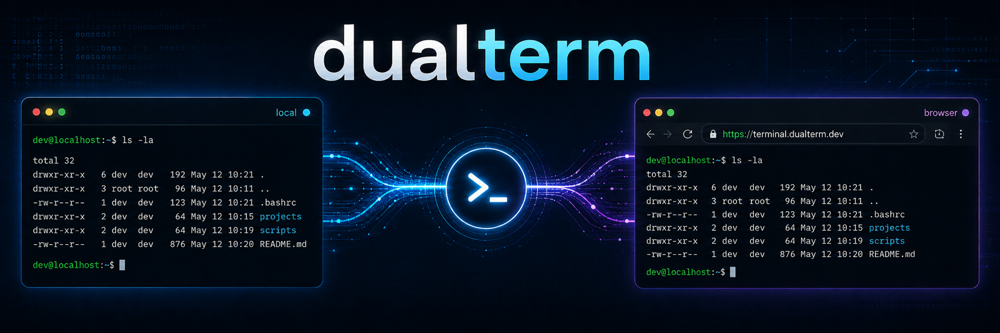

# dualterm

TUIとブラウザの両方からローカルマシンの実shell環境にアクセスするツール。iTermがあればローカルで直結、無い環境ではブラウザ経由(Cloudflare Tunnel + Access)で同じshellに繋がる。

設計は `docs/spec.md` に置く。開発順序は 設計 → テストコード → 実装 で固定する。

## status

設計確定。サーバー側コア(PTYエンジン + WebSocketブリッジ)を実装・テストgreenまで完了。iTerm/ブラウザ側クライアント、Cloudflare Tunnel設定、認証はこれから。
